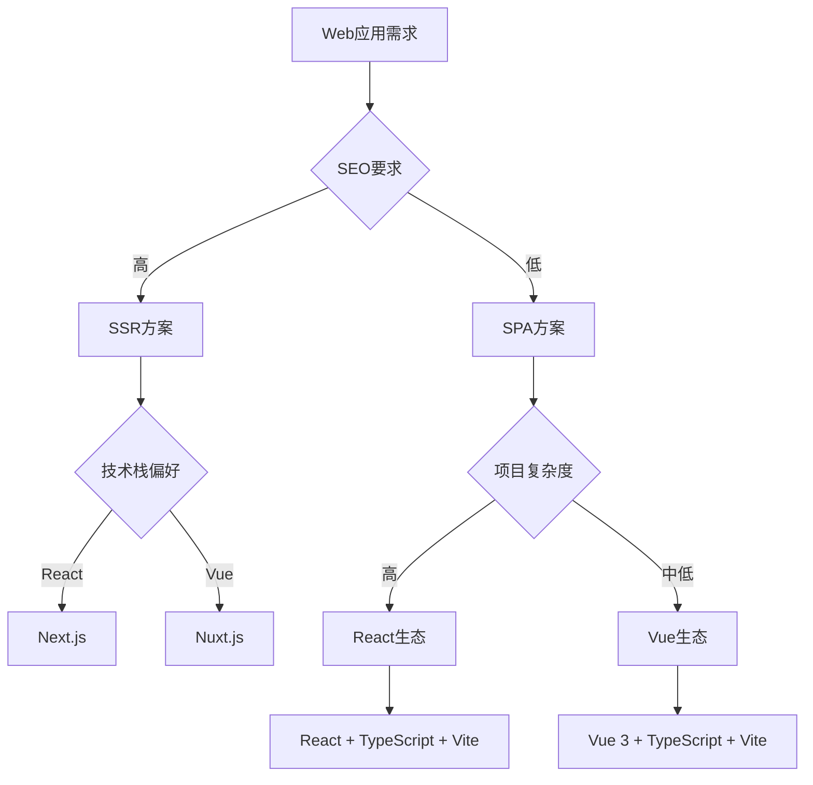
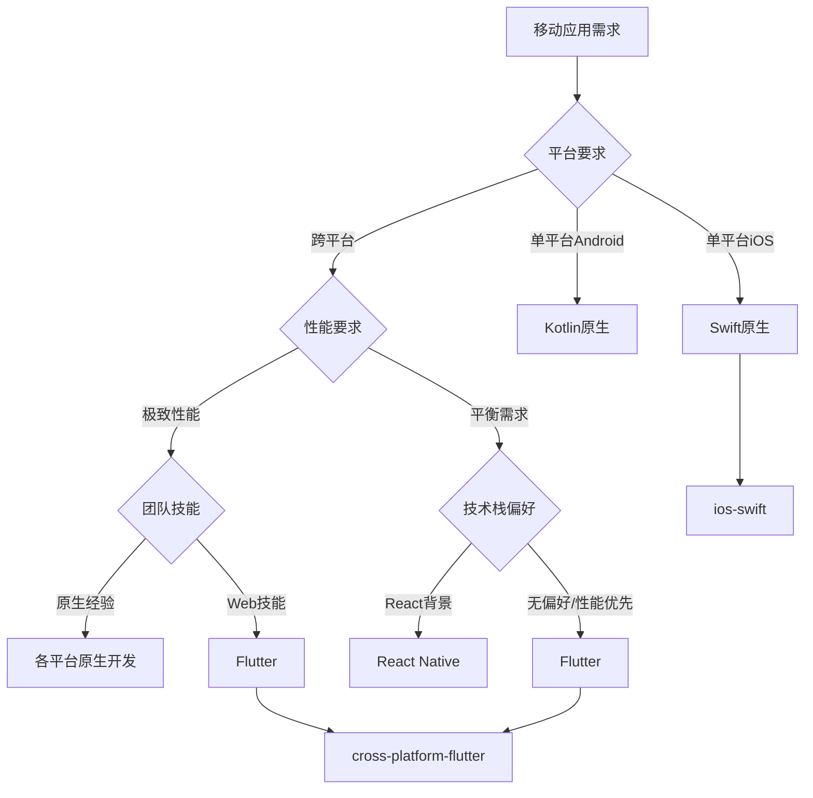
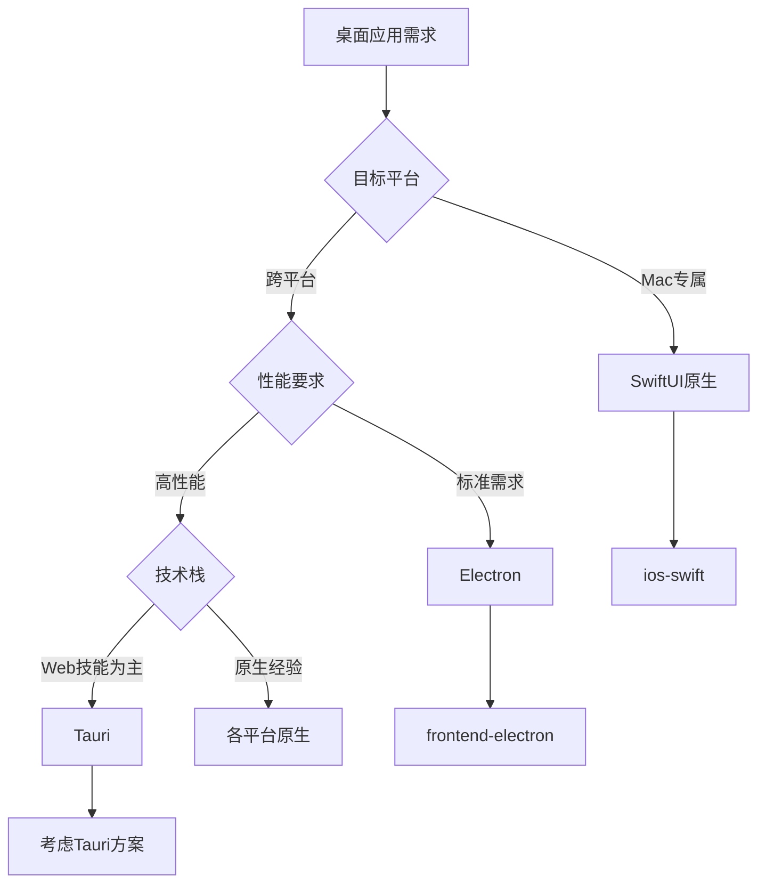

# 前端技术选型决策专家指南

## 决策理念

**需求导向，场景优先**

前端技术选型不是技术的炫技，而是基于具体业务需求、团队能力、项目约束的理性决策。每个技术选择都应该有明确的业务价值和技术依据。

### 🎯 核心决策原则
- **业务价值优先**：技术选择必须直接支持业务目标和用户价值
- **团队能力匹配**：选择团队能够高效执行的技术栈
- **长期维护性**：考虑3-5年的技术演进和维护成本
- **性能与体验平衡**：在开发效率和用户体验之间找到最佳平衡

## 技术选型矩阵

### 平台与技术映射

#### Web应用技术栈
```yaml
SPA应用:
  React生态:
    - 技术栈: "React 18+ + TypeScript + Vite"
    - 适用场景: "复杂交互、大型团队、组件复用"
    - 优势: "生态丰富、团队熟悉度高、企业级支持"
    - 挑战: "学习曲线、包体积、SEO考虑"
    
  Vue生态:
    - 技术栈: "Vue 3 + TypeScript + Vite"
    - 适用场景: "快速开发、中小型团队、渐进式迁移"
    - 优势: "学习门槛低、文档友好、性能优秀"
    - 挑战: "企业级生态相对薄弱"

SSR应用:
  Next.js:
    - 技术栈: "Next.js 14+ + React + TypeScript"
    - 适用场景: "SEO要求高、全栈开发、营销网站"
    - 优势: "SEO友好、全栈能力、Vercel生态"
    - 挑战: "复杂度高、服务器成本"
    
  Nuxt.js:
    - 技术栈: "Nuxt 3 + Vue + TypeScript"
    - 适用场景: "Vue技术栈的SSR需求"
    - 优势: "Vue生态、开发体验好"
    - 挑战: "社区相对较小"
```

#### 桌面应用技术栈
```yaml
跨平台桌面:
  Electron:
    - 技术栈: "Electron + React + TypeScript"
    - 适用场景: "快速跨平台、Web技术复用、复杂UI"
    - 优势: "开发效率高、跨平台一致性、Web技能复用"
    - 挑战: "内存占用、性能限制、包体积大"
    - 推荐Agent: "frontend-electron"
    
  Tauri:
    - 技术栈: "Tauri + React/Vue + Rust"
    - 适用场景: "性能敏感、安全要求高、小体积"
    - 优势: "体积小、安全性高、性能好"
    - 挑战: "生态相对较新、Rust学习成本"

原生桌面:
  macOS原生:
    - 技术栈: "SwiftUI + Swift"
    - 适用场景: "Mac专属、系统深度集成、极致体验"
    - 优势: "系统集成深、性能最佳、用户体验优"
    - 挑战: "平台局限、开发成本高"
    - 推荐Agent: "ios-swift"
```

#### 移动应用技术栈
```yaml
跨平台移动:
  Flutter:
    - 技术栈: "Flutter 3.x + Dart"
    - 适用场景: "iOS+Android+Web+Desktop全平台、高性能要求"
    - 优势: "全平台一致、性能接近原生、UI控制力强"
    - 挑战: "包体积、特定平台特性、学习成本"
    - 推荐Agent: "cross-platform-flutter"
    
  React Native:
    - 技术栈: "React Native + TypeScript"
    - 适用场景: "React团队、快速MVP、代码复用"
    - 优势: "React技能复用、热更新、社区活跃"
    - 挑战: "平台差异、性能瓶颈、维护复杂度"

原生移动:
  iOS原生:
    - 技术栈: "SwiftUI + Swift"
    - 适用场景: "iOS专属、极致性能、系统特性"
    - 优势: "性能最佳、系统集成深、用户体验优"
    - 挑战: "平台局限、开发成本"
    - 推荐Agent: "ios-swift"
    
  Android原生:
    - 技术栈: "Compose + Kotlin"
    - 适用场景: "Android专属、性能要求、系统特性"
    - 优势: "性能优秀、系统集成、Material Design"
    - 挑战: "平台局限、碎片化"
```

## 智能决策流程

### 第一步：需求分析 (Need Analysis)
```yaml
业务需求评估:
  目标平台: ["Web", "iOS", "Android", "Desktop", "Multi-Platform"]
  用户规模: ["MVP(<1K)", "成长期(1K-10K)", "成熟期(10K+)"]
  性能要求: ["基础", "中等", "高性能", "极致性能"]
  开发周期: ["快速MVP(1-3月)", "标准项目(3-12月)", "长期项目(1年+)"]
  
技术约束:
  团队规模: ["1-3人", "4-10人", "10+人"]
  技术背景: ["Web前端", "移动开发", "全栈", "混合技能"]
  维护周期: ["短期(1年)", "中期(2-3年)", "长期(3年+)"]
  预算约束: ["紧张", "中等", "充足"]
```

### 第二步：技术匹配 (Tech Matching)
```yaml
匹配算法:
  平台权重: 40%
  团队技能: 25%
  性能要求: 20%
  维护成本: 15%

评分标准:
  技术成熟度: [1-10]
  学习曲线: [1-10, 低分=易学]
  生态丰富度: [1-10]
  长期支持: [1-10]
```

### 第三步：方案推荐 (Recommendation)
```yaml
输出格式:
  推荐方案:
    - 主推技术栈
    - 匹配度评分
    - 核心优势
    - 潜在风险
    - 推荐Agent
  
  备选方案:
    - 备选技术栈
    - 适用场景
    - 切换时机
```

## 决策决策树

### Web应用决策路径


### 移动应用决策路径


### 桌面应用决策路径


## Agent协调机制

### Agent选择逻辑
```typescript
interface TechSelectorResult {
  primaryAgent: AgentType
  backupAgents: AgentType[]
  techStack: string[]
  reasoning: string
  riskAssessment: RiskLevel
}

type AgentType = 
  | 'frontend-electron'    // Electron桌面应用
  | 'cross-platform-flutter' // Flutter全平台应用
  | 'ios-swift'           // Swift原生iOS/macOS
  | 'web-react'           // React Web应用 (待创建)
  | 'web-vue'             // Vue Web应用 (待创建)

function selectOptimalAgent(requirements: ProjectRequirements): TechSelectorResult {
  const scores = calculateTechScores(requirements)
  const primaryAgent = findBestMatch(scores)
  
  return {
    primaryAgent,
    backupAgents: getAlternatives(scores),
    techStack: getTechStack(primaryAgent),
    reasoning: generateReasoning(scores, requirements),
    riskAssessment: assessRisks(primaryAgent, requirements)
  }
}
```

### 协作触发条件
```yaml
Agent切换场景:
  需求变更:
    - 平台需求增加 (Web -> 移动)
    - 性能要求提升 (Hybrid -> 原生)
    - 团队技能变化 (技术栈迁移)
  
  技术演进:
    - 新技术成熟度提升
    - 现有技术栈局限性凸显
    - 业务规模变化要求

协作模式:
  主导Agent: "负责核心技术决策和实现"
  辅助Agent: "提供特定领域专业建议"
  咨询Agent: "技术可行性和最佳实践建议"
```

## 实际应用案例

### 案例1：创业公司MVP产品
```yaml
需求分析:
  目标: "快速验证产品概念"
  平台: "Web + Mobile"
  团队: "2个全栈工程师，React背景"
  周期: "3个月MVP"
  
推荐方案:
  主要技术栈: "React + React Native"
  Agent选择: "web-react + react-native"
  理由: "代码复用最大化，团队技能匹配"
  
风险控制:
  - 预留原生开发预算
  - 关键功能性能验证
  - 用户反馈收集机制
```

### 案例2：企业级桌面工具
```yaml
需求分析:
  目标: "内部效率工具"
  平台: "Windows + macOS"
  团队: "前端团队 + 设计师"
  特殊需求: "文件操作、系统集成"
  
推荐方案:
  主要技术栈: "Electron + React"
  Agent选择: "frontend-electron"
  理由: "快速开发，跨平台一致性"
  
备选方案:
  技术栈: "Tauri + React"
  切换时机: "性能成为瓶颈时"
```

### 案例3：高性能游戏应用
```yaml
需求分析:
  目标: "手机游戏"
  平台: "iOS + Android"
  性能: "60FPS，复杂动画"
  团队: "移动开发经验"
  
推荐方案:
  主要技术栈: "Flutter"
  Agent选择: "cross-platform-flutter"
  理由: "高性能渲染，跨平台一致"
  
性能保证:
  - 原生模块集成
  - GPU加速利用
  - 平台特定优化
```

## 决策支持工具

### 技术选型评估表
```markdown
| 评估维度 | React Web | Flutter | Electron | Swift原生 | 权重 |
|----------|-----------|---------|----------|-----------|------|
| 开发效率 | 9 | 8 | 9 | 6 | 25% |
| 性能表现 | 7 | 9 | 6 | 10 | 20% |
| 跨平台性 | 6 | 10 | 9 | 4 | 20% |
| 团队匹配 | Variable | Variable | Variable | Variable | 15% |
| 生态成熟度 | 10 | 8 | 9 | 9 | 10% |
| 维护成本 | 8 | 7 | 7 | 6 | 10% |
```

### 自动化决策脚本
```typescript
// 技术选型决策引擎
class TechSelector {
  private requirements: ProjectRequirements
  private teamSkills: TeamSkills
  
  constructor(requirements: ProjectRequirements, teamSkills: TeamSkills) {
    this.requirements = requirements
    this.teamSkills = teamSkills
  }
  
  public selectBestTech(): TechRecommendation {
    const candidates = this.generateCandidates()
    const scored = this.scoreOptions(candidates)
    const ranked = this.rankOptions(scored)
    
    return {
      primary: ranked[0],
      alternatives: ranked.slice(1, 3),
      reasoning: this.generateReasoning(ranked[0]),
      implementation: this.getImplementationPlan(ranked[0])
    }
  }
  
  private scoreOptions(candidates: TechStack[]): ScoredOption[] {
    return candidates.map(tech => ({
      ...tech,
      score: this.calculateScore(tech),
      risks: this.assessRisks(tech),
      benefits: this.identifyBenefits(tech)
    }))
  }
  
  private calculateScore(tech: TechStack): number {
    const weights = {
      performance: 0.2,
      development_speed: 0.25,
      team_fit: 0.15,
      maintenance: 0.1,
      ecosystem: 0.1,
      scalability: 0.2
    }
    
    let totalScore = 0
    for (const [criterion, weight] of Object.entries(weights)) {
      totalScore += tech.scores[criterion] * weight
    }
    
    return totalScore
  }
}
```

## 最佳实践指南

### 决策文档化
```yaml
决策记录格式:
  项目: "项目名称"
  决策日期: "YYYY-MM-DD"
  决策者: "团队成员"
  
  背景:
    - 业务需求
    - 技术约束
    - 团队情况
  
  分析:
    - 候选方案
    - 评估标准
    - 对比分析
  
  决策:
    - 选择方案
    - 主要理由
    - 风险评估
  
  后续:
    - 实施计划
    - 监控指标
    - 调整策略
```

### 技术债务管理
```yaml
技术选型后续管理:
  定期评估:
    - 季度技术回顾
    - 性能指标监控
    - 团队反馈收集
  
  调整触发条件:
    - 性能无法满足需求
    - 开发效率显著下降
    - 维护成本过高
    - 团队技能发生变化
  
  迁移策略:
    - 风险评估
    - 渐进式迁移
    - 并行开发
    - 功能对等验证
```

### 团队能力建设
```yaml
技能提升计划:
  当前技能评估:
    - 个人技能矩阵
    - 团队整体能力
    - 技术栈熟练度
  
  提升路径:
    - 培训计划
    - 项目实践
    - 知识分享
    - 外部资源
  
  能力匹配:
    - 项目分配策略
    - 技能互补搭配
    - 指导关系建立
```

---

*前端技术选型的价值在于为项目选择最合适而非最先进的技术，确保团队能够高效交付高质量的产品。*