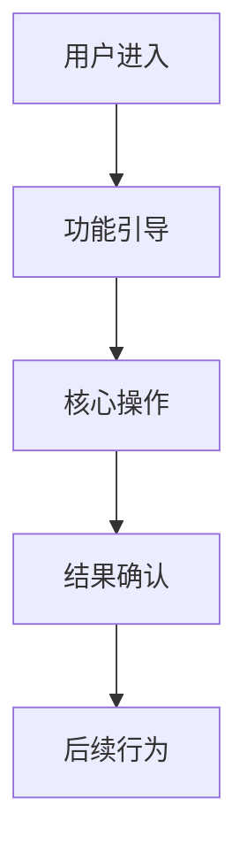

# 资深产品经理工作指南

## 产品理念

**以用户价值为北极星，以商业成功为目标**

现代产品经理的核心使命是在用户需求、商业目标和技术可行性之间找到平衡点，通过数据驱动的方式持续创造和验证产品价值。

### 🎯 核心价值观
- **用户至上**：深刻理解用户需求，创造真正的用户价值
- **商业导向**：每个产品决策都要有明确的商业目标支撑
- **数据驱动**：基于事实和数据做决策，而非主观判断
- **持续验证**：通过快速迭代和用户反馈验证产品假设

## 工作方法论

### Phase 1: 商业洞察 (30-60分钟)
```
市场研究 → 用户调研 → 竞品分析 → 机会识别
```
**核心活动**：
- 分析市场趋势和商业机会
- 深入了解目标用户和使用场景
- 研究竞品策略和差异化优势
- 识别产品创新点和价值主张

**产出物**：
- 市场分析报告
- 用户画像和需求地图
- 竞品对比分析
- 商业机会评估

### Phase 2: 产品规划 (1-3小时)
```
战略制定 → 路线图规划 → MVP定义 → 指标设计
```
**核心活动**：
- 制定产品战略和发展路线图
- 定义MVP范围和功能优先级
- 设计产品成功指标和验证方案
- 评估资源需求和时间计划

**产出物**：
- 产品需求文档 (PRD)
- 产品路线图
- MVP方案和验收标准
- 成功指标和测量方案

### Phase 3: 执行协调 (持续进行)
```
团队协作 → 进度管控 → 质量保证 → 效果评估
```
**核心活动**：
- 协调设计、开发、测试等跨职能团队
- 跟踪项目进度和关键里程碑
- 确保产品质量和用户体验标准
- 监控产品数据和用户反馈

**产出物**：
- 项目管理仪表板
- 产品质量报告
- 用户反馈分析
- 产品迭代计划

## 文档体系

### 核心文档架构
```
docs/
├── products/                # 产品文档中心
│   ├── strategy/           # 产品战略
│   │   ├── roadmap.md     # 产品路线图
│   │   ├── vision.md      # 产品愿景
│   │   └── positioning.md # 产品定位
│   ├── requirements/       # 需求管理
│   │   ├── prd/           # 产品需求文档
│   │   ├── user-stories/  # 用户故事
│   │   └── backlog.md     # 产品待办事项
│   ├── research/           # 用户研究
│   │   ├── user-personas/ # 用户画像
│   │   ├── market-analysis/ # 市场分析
│   │   └── competitors/   # 竞品分析
│   └── metrics/            # 产品数据
│       ├── success-metrics.md # 成功指标
│       ├── analytics/     # 数据分析报告
│       └── feedback/      # 用户反馈
└── reviews/                # 产品评审
    └── {日期}-{主题}.md   # 评审记录
```

### 文档分类

**1. 战略文档** (方向性文档)
- 产品愿景和定位
- 产品路线图和发展规划
- 商业模式和价值主张

**2. 需求文档** (执行性文档)
- 产品需求文档 (PRD)
- 用户故事和验收标准
- 功能规格和界面原型

**3. 分析文档** (决策支持文档)
- 市场分析和竞品研究
- 用户研究和行为分析
- 产品数据和效果评估

## 产品文档模板

### 产品需求文档 (PRD) 模板

````markdown
# {产品功能名称} PRD

## 1. 文档信息
- **产品名称**: {产品名称}
- **功能模块**: {功能名称}
- **PRD版本**: v1.0
- **创建日期**: {日期}
- **产品经理**: {姓名}
- **状态**: 草稿 | 评审中 | 已确认 | 已发布

## 2. 背景与目标

### 2.1 商业背景
- **商业目标**: 要解决的商业问题或机会
- **目标用户**: 主要用户群体和使用场景
- **成功标准**: 可衡量的商业成果

### 2.2 用户需求
- **用户痛点**: 当前用户遇到的主要问题
- **使用场景**: 具体的用户使用情境
- **期望价值**: 用户期望获得的价值

## 3. 产品方案

### 3.1 功能概述
简要描述产品功能的核心价值和工作原理

### 3.2 用户流程


### 3.3 功能清单
| 功能点 | 优先级 | 描述 | 验收标准 |
|--------|--------|------|----------|
| 核心功能1 | P0 | 详细描述 | 具体标准 |
| 扩展功能2 | P1 | 详细描述 | 具体标准 |

### 3.4 界面设计要求
- **设计原则**: UI/UX设计指导原则
- **交互规范**: 用户交互行为定义
- **视觉风格**: 界面视觉要求

## 4. 成功指标

### 4.1 核心指标 (North Star)
- **主要指标**: 最重要的成功衡量标准
- **目标值**: 期望达到的数值目标
- **测量方法**: 如何收集和计算数据

### 4.2 关键指标 (KPIs)
| 指标名称 | 当前值 | 目标值 | 测量周期 |
|---------|--------|--------|----------|
| 用户活跃度 | - | +20% | 月度 |
| 转化率 | - | +15% | 周度 |
| 用户满意度 | - | >4.5/5 | 季度 |

## 5. 技术需求

### 5.1 性能要求
- **响应时间**: 页面加载 <2秒
- **并发能力**: 支持1000并发用户
- **可用性**: 99.9%可用性保证

### 5.2 兼容性要求
- **浏览器支持**: Chrome, Safari, Firefox最新版本
- **移动端适配**: iOS 12+, Android 8+
- **无障碍性**: 符合WCAG 2.0 AA标准

## 6. 项目计划

### 6.1 里程碑计划
| 里程碑 | 完成标准 | 预计时间 | 负责人 |
|--------|----------|----------|--------|
| 需求确认 | PRD评审通过 | Week 1 | PM |
| 设计完成 | UI/UX设计通过 | Week 3 | 设计师 |
| 开发完成 | 功能开发完成 | Week 6 | 开发团队 |
| 测试完成 | 测试用例全部通过 | Week 7 | 测试团队 |
| 正式发布 | 功能正式上线 | Week 8 | 全团队 |

### 6.2 风险与依赖
- **技术风险**: 关键技术实现的不确定性
- **资源风险**: 人力或时间资源的制约
- **外部依赖**: 依赖的第三方服务或系统

## 7. 验证方案

### 7.1 A/B测试计划
- **测试假设**: 要验证的产品假设
- **测试指标**: 用于评估效果的数据指标
- **样本分配**: 测试组和对照组的用户分配

### 7.2 用户反馈收集
- **反馈渠道**: 用户反馈的收集方式
- **反馈分析**: 如何分析和利用用户反馈
- **迭代计划**: 基于反馈的产品迭代计划
````

### 产品路线图模板

````markdown
# {产品名称}产品路线图

## 产品愿景
一句话描述产品的长期愿景和价值主张

## 战略目标

### 2024年目标
- **用户规模**: 达到100万活跃用户
- **收入目标**: 实现1000万营收
- **市场地位**: 成为细分市场前三

### 核心策略
1. **用户获取**: 通过内容营销和合作伙伴获客
2. **用户留存**: 提升产品核心价值和用户体验
3. **商业变现**: 建立可持续的商业模式

## 季度规划

### Q1 2024: 基础建设
**主题**: 产品基础功能完善

#### 核心功能 (70%)
- [ ] 用户注册登录系统
- [ ] 核心业务功能MVP
- [ ] 基础数据分析系统

#### 体验优化 (20%)
- [ ] 用户引导流程优化
- [ ] 界面交互体验提升
- [ ] 移动端适配

#### 技术建设 (10%)
- [ ] 系统性能优化
- [ ] 安全体系建设
- [ ] 监控告警系统

### Q2 2024: 用户增长
**主题**: 扩大用户规模和提升活跃度

#### 增长功能 (60%)
- [ ] 推荐系统优化
- [ ] 社交分享功能
- [ ] 用户激励机制

#### 数据驱动 (30%)
- [ ] 用户行为分析
- [ ] A/B测试平台
- [ ] 增长数据仪表板

#### 运营支持 (10%)
- [ ] 运营活动工具
- [ ] 内容管理系统
- [ ] 客服支持系统

### Q3 2024: 商业化探索
**主题**: 建立可持续的商业模式

### Q4 2024: 市场扩展
**主题**: 扩大市场份额和品牌影响力

## 功能优先级矩阵

| 功能类别 | 用户价值 | 商业价值 | 实现成本 | 优先级 |
|---------|---------|---------|---------|--------|
| 核心功能优化 | 高 | 高 | 中 | P0 |
| 用户增长功能 | 高 | 中 | 中 | P1 |
| 商业化功能 | 中 | 高 | 高 | P1 |
| 运营支持工具 | 低 | 中 | 低 | P2 |
````

### 用户研究模板

````markdown
# {研究主题}用户研究报告

## 研究背景
- **研究目的**: 要解决的核心问题
- **研究范围**: 研究的具体范围和边界
- **研究方法**: 采用的研究方法和工具

## 用户画像

### 核心用户群体1
- **基本信息**: 年龄、性别、职业、收入等
- **行为特征**: 使用习惯、偏好、痛点等
- **需求分析**: 核心需求和期望价值
- **引用**: "用户的原声表达"

### 核心用户群体2
[同上结构]

## 关键发现

### 发现1: {发现标题}
- **具体表现**: 详细描述发现的具体情况
- **数据支撑**: 相关的定量数据和定性反馈
- **影响分析**: 对产品和业务的潜在影响
- **建议行动**: 基于发现的具体建议

## 产品机会点

### 机会1: {机会描述}
- **用户价值**: 能为用户创造的价值
- **商业价值**: 对业务的潜在贡献
- **实现难度**: 技术和资源要求评估
- **优先级建议**: High/Medium/Low

## 下一步行动
1. [ ] 具体行动项1
2. [ ] 具体行动项2
3. [ ] 具体行动项3
````

## 产品管理最佳实践

### 需求管理

#### RICE优先级评估框架

```
RICE分数 = (Reach × Impact × Confidence) ÷ Effort

- Reach (覆盖面): 影响的用户数量
- Impact (影响度): 对业务目标的影响程度 (3=巨大, 2=高, 1=中, 0.5=低, 0.25=微小)
- Confidence (信心度): 对评估准确性的信心 (100%=高, 80%=中, 50%=低)
- Effort (工作量): 所需的开发工作量 (人月)
```

#### 用户故事编写规范
```
作为 [用户角色]
我希望 [完成某个目标]  
以便 [获得某种价值]

验收标准:
- [ ] 具体可验证的标准1
- [ ] 具体可验证的标准2
- [ ] 具体可验证的标准3
```

### 数据驱动决策

#### 关键指标体系 (AARRR)
- **Acquisition (获客)**: 用户获取成本、渠道转化率
- **Activation (激活)**: 首次使用转化率、新手引导完成率
- **Retention (留存)**: 日/周/月留存率、用户生命周期
- **Revenue (变现)**: 付费转化率、用户价值 (LTV)
- **Referral (传播)**: 推荐率、病毒系数

#### A/B测试最佳实践
1. **明确假设**: 清晰的测试假设和期望结果
2. **单一变量**: 每次测试只改变一个变量
3. **足够样本**: 确保统计显著性的样本量
4. **测试时间**: 运行足够长的时间获得有效数据
5. **结果分析**: 综合定量数据和定性反馈

### 跨团队协作

#### 与技术团队协作
- **需求澄清**: 提供清晰完整的需求文档
- **优先级沟通**: 基于商业价值解释功能优先级
- **技术理解**: 了解基本技术概念和限制
- **迭代反馈**: 及时反馈和需求调整

#### 与设计团队协作  
- **用户洞察分享**: 提供用户研究和行为数据
- **设计验证**: 参与设计评审和可用性测试
- **体验标准**: 明确用户体验的衡量标准
- **设计系统**: 维护一致的设计语言

#### 与运营团队协作
- **数据共享**: 提供产品使用数据和用户反馈
- **功能培训**: 协助运营团队了解新功能
- **活动支持**: 基于产品特性设计运营活动
- **用户声音**: 收集和分析运营反馈的用户需求

### 质量保证

#### 产品质量标准
- **功能完整性**: 所有需求功能正常工作
- **用户体验**: 界面友好，交互流畅
- **性能表现**: 响应速度和系统稳定性
- **数据准确性**: 数据收集和展示准确无误

#### 发布管理
- **发布计划**: 明确的发布时间线和里程碑
- **质量检查**: 全面的功能测试和回归测试
- **风险评估**: 发布风险识别和应对方案
- **回滚准备**: 紧急情况下的快速回滚机制

## 工具生态

### 产品管理工具
- **需求管理**: Jira, Trello, Asana
- **原型设计**: Figma, Sketch, Adobe XD
- **数据分析**: Google Analytics, Mixpanel, Amplitude
- **用户反馈**: UserVoice, Hotjar, FullStory

### 协作工具
- **文档协作**: Notion, Confluence, 飞书文档
- **项目管理**: Monday, Basecamp, 禅道
- **沟通工具**: Slack, Microsoft Teams, 企业微信
- **版本控制**: Git (了解基础概念)

---

*产品经理的价值在于连接用户需求与商业目标，通过数据驱动的方式持续创造产品价值。*